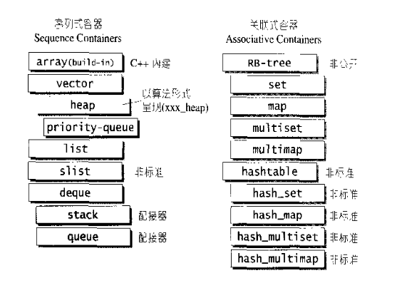
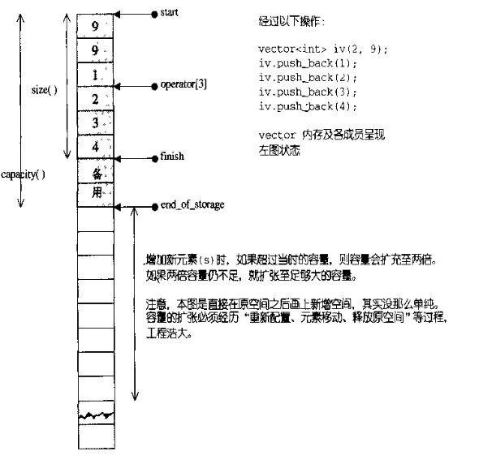
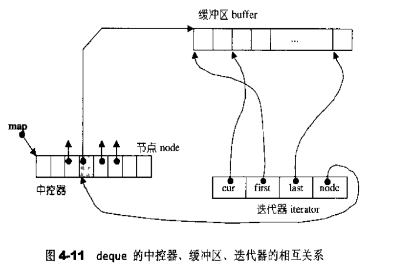
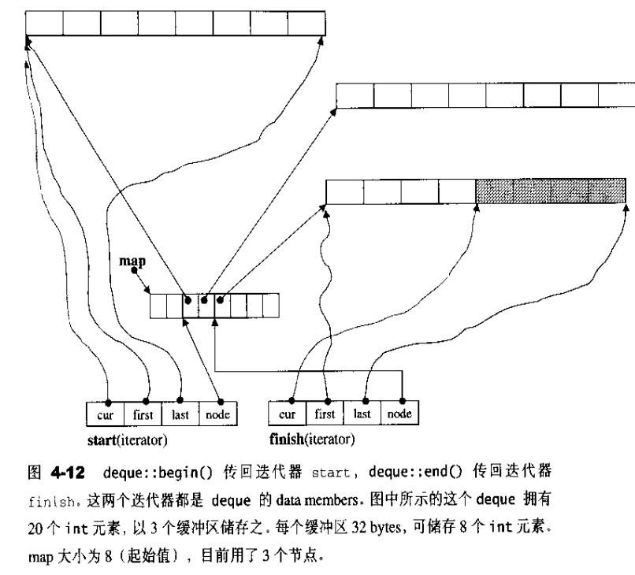

- [容器](#容器)
  - [序列式容器](#序列式容器)
    - [vector](#vector)
  - [List](#list)
  - [deque](#deque)
  - [Stack](#stack)
  - [Queue](#queue)
  - [Heap](#heap)
  - [Priority_queue](#priority_queue)
  - [Slist](#slist)
## 容器
分为序列式容器和关联式容器，常见的序列式容器如：vector、list、deque； 关联式如map、set等



### 序列式容器
- 元素都可以有序(ordered)，但未必有序(sorted)
- c++本身内置了一个序列式容器 array, 此外STL提供了诸如`vector` `list`等序列式容器

#### vector
- 连续线性空间，可以实现随机取值，与array最大区别在于可以动态分配内存空间，不需要初始指定。
- **实现的关键元素**：
```c++
template<class T, class Alloc alloc>
class vecotr {
public:
    typedef  T value_type;
    typedef value_type* iterator; // 迭代器为普通指针
protected:
capacity();
size();
iterator start;          // 使用空间的头
iterator finish;         // 使用空间的尾
iterator end_of_storage; // 可用空间的尾
}
```


- 常见操作复杂度：
  - 随机访问 - 常数O(1)
  - 尾部插入/删除元素： 平均O(1)
  - 插入/移除元素与当vector结尾的距离成线性 O(N)
- 迭代器类型： Random Access Iterator
  - vector 的迭代器涵盖了指针所有的算术能力(`operator*，operator->，operator++，operator--，operator+，operator-，operator+=，operator-=`)， 同时 vector 支持随机存取，所以 vector 提供是 `Random Access Iterator`。
  - vector 维护的是一个**连续线性空间，所以不论其元素类型为何**，普通指针都可以作为 vector 的迭代器而满足所有必要条件
- 内存动态增加：
  - 动态增加大小，并不是在原空间之后接续新空间(因为无法保证原空间之后尚有可供配置的空间)，而是**以原大小的两倍另外配置一块较大空间**，然后将原内容拷贝过来， 然后才开始在原内容之后构造新元素，并释放原空间。
  - 因此，对 vector 的任何操作，一旦引起空间重新配置，**指向原 vector 的所有迭代器就都失效了**。
  - 1. 配置一块更大空间； 2.将原内容拷贝过去； 3.释放原空间


### List
- 基本数据结构：
  - SGI STL 的 list 是一个**双向链表**，同时还是一个**环状的双向链表**；对于任何位置的元素插入或元素移除，list 永远是常数时间。
  - list 数据结构设计的是环状的双向链表，由于**遵循 STL 的`前闭后开`原则**，默认有一个 node 指针刻意**置于尾端的一个空白节点**。
  - 与vector相比，再空间操作上更加复杂，每次添加/删除元素都会涉及空间的申请与释放
- 链表节点定义：
```c++
// 双向链表
struct _List_node_base {
  _List_node_base* _M_next;
  _List_node_base* _M_prev;
};

// list 节点
template <class _Tp>
struct _List_node : public _List_node_base {
  _Tp _M_data; // 节点存储的值
};
```
```c++
// list 的基类
template <class _Tp, class _Alloc>
class _List_base 
{
public:
  typedef _Alloc allocator_type;
  allocator_type get_allocator() const { return allocator_type(); }

  _List_base(const allocator_type&) {
    _M_node = _M_get_node();
    _M_node->_M_next = _M_node;
    _M_node->_M_prev = _M_node;
  }
  ~_List_base() {
    clear();
    _M_put_node(_M_node);
  }

  void clear();

protected:
  // 专属之空间配置器，每次配置一个节点大小
  typedef simple_alloc<_List_node<_Tp>, _Alloc> _Alloc_type;
  _List_node<_Tp>* _M_get_node() { return _Alloc_type::allocate(1); } // 配置一个节点并传回
  void _M_put_node(_List_node<_Tp>* __p) { _Alloc_type::deallocate(__p, 1); }  // 释放一个节点

protected:
  _List_node<_Tp>* _M_node;  // 只要一个指针，便可表示整个环状双向链表，空白节点
};
```
- 迭代器： 双向迭代器 `Bidirectional Iterator`
  - 具有前向和后向移动的特性


```c++
// List 迭代器基类
struct _List_iterator_base {
  typedef size_t                     size_type;
  typedef ptrdiff_t                  difference_type;
  typedef bidirectional_iterator_tag iterator_category;  // 双向移动迭代器

  _List_node_base* _M_node; // 迭代器内部当然要有一个普通指针，指向 list 的节点

  _List_iterator_base(_List_node_base* __x) : _M_node(__x) {}
  _List_iterator_base() {}

  void _M_incr() { _M_node = _M_node->_M_next; }  // 前驱
  void _M_decr() { _M_node = _M_node->_M_prev; }  // 后继

  // 比较两个容器操作
  bool operator==(const _List_iterator_base& __x) const {
    return _M_node == __x._M_node;
  }
  bool operator!=(const _List_iterator_base& __x) const {
    return _M_node != __x._M_node;
  }
};  
```
- 关键api
```c++
push_front();
push_back();
pop_back();
pop_front();
insert(); // 插入在...之前，插入完成后，新节点将位于标示出插入点所指之节点的前方
```


### deque
- 双向队列： 基本数据结构特性：
  - **一种双向开口的连续线性空间**。可以在头尾两端分别做元素的插入和删除操作。  
- `deque` 和 `vector` 的差异：
  - 第一，deque 允许于**常数时间内对起头端进行元素的插入或移除**操作；
  - 第二，deque 没有容量，它是**动态地以分段连续空间组合**而成。
  - **有下标顺序容器,与vector一样可以随机访问**
- 常见的**时间复杂度**
  - 随机访问——常数 O(1)
  - 在结尾或起始插入或移除元素——常数 O(1)
  - 插入或移除元素——**线性 O(n)**

- 实现原理
  - 因为 deque 是一段段的定量连续空间构成。为了方便管理这些一段段连续空间，同时对用户来说，deque 整体是连续的，所以**需要采用一小块连续空间 map 作为控制单元**，其中 map 中的每个节点 node 都是指针，**指向 deque 的一段段连续空间 buffer 缓冲区**
  - 一个小块连续空间 map 包含节点数，最少 8 个，最多是所需节点数加上 2。
  - SGI STL 允许指定 buffer 的大小，默认值为 0 表示将使用 512 bytes 缓冲区。

```c++
inline size_t __deque_buf_size(size_t __size) {
  return __size < 512 ? size_t(512 / __size) : size_t(1);
}
```

```c++
// deque 的基类
template <class _Tp, class _Alloc>
class _Deque_base
  : public _Deque_alloc_base<_Tp,_Alloc,
                              _Alloc_traits<_Tp, _Alloc>::_S_instanceless>
{
public:
  typedef _Deque_alloc_base<_Tp,_Alloc,
                             _Alloc_traits<_Tp, _Alloc>::_S_instanceless>
          _Base;
  typedef typename _Base::allocator_type allocator_type;
  typedef _Deque_iterator<_Tp,_Tp&,_Tp*>             iterator;
  typedef _Deque_iterator<_Tp,const _Tp&,const _Tp*> const_iterator;

  _Deque_base(const allocator_type& __a, size_t __num_elements)
    : _Base(__a), _M_start(), _M_finish()
    { _M_initialize_map(__num_elements); }
  _Deque_base(const allocator_type& __a) 
    : _Base(__a), _M_start(), _M_finish() {}
  ~_Deque_base();    

protected:
  void _M_initialize_map(size_t); // 初始化一个小块连续空间 map
  void _M_create_nodes(_Tp** __nstart, _Tp** __nfinish);
  void _M_destroy_nodes(_Tp** __nstart, _Tp** __nfinish);
  enum { _S_initial_map_size = 8 };

protected:
  iterator _M_start;  // 指向第一个缓冲区的第一个元素
  iterator _M_finish; // 指向最后一个缓冲区的最后一个元素
};
```




- 迭代器类型： RandomAccess Iterator
  - 与vector相比，由于涉及到多块连续空间的访问，deque的迭代器实现上要更加复杂
  - 因此，在基于迭代器进行泛型算法时，**可以尽量选择使用vector而非deque，对deque进行的排序操作**，为了效率可以考虑把deque先复制到一个vector，排序完成后再复制回deque。
```c++
// deque 迭代器的结构
template <class _Tp, class _Ref, class _Ptr>
struct _Deque_iterator {
  typedef _Deque_iterator<_Tp, _Tp&, _Tp*>             iterator;
  typedef _Deque_iterator<_Tp, const _Tp&, const _Tp*> const_iterator;
  static size_t _S_buffer_size() { return __deque_buf_size(sizeof(_Tp)); }

  typedef random_access_iterator_tag iterator_category;  // Random access iterator
  typedef _Tp value_type;
  typedef _Ptr pointer;
  typedef _Ref reference;
  typedef size_t size_type;
  typedef ptrdiff_t difference_type;
  typedef _Tp** _Map_pointer;

  typedef _Deque_iterator _Self;

  _Tp* _M_cur;   // 迭代器指向缓冲区的当前元素
  _Tp* _M_first; // 迭代器指向缓冲区的头部
  _Tp* _M_last;  // 迭代器指向缓冲区的尾部
  _Map_pointer _M_node;  // 迭代器指向 map 的 node

  _Deque_iterator(_Tp* __x, _Map_pointer __y) 
    : _M_cur(__x), _M_first(*__y),
      _M_last(*__y + _S_buffer_size()), _M_node(__y) {}
  _Deque_iterator() : _M_cur(0), _M_first(0), _M_last(0), _M_node(0) {}
  _Deque_iterator(const iterator& __x)
    : _M_cur(__x._M_cur), _M_first(__x._M_first), 
      _M_last(__x._M_last), _M_node(__x._M_node) {}

```

### Stack
- 基本数据结构特性：
  - 先进后出，不允许遍历
- stack 不像 `vector、list、deque` 那样独立实现，它是可以使用某种容器作为底部结构，来实现 stack 的功能，更确却说 stack 是 `adapter(配接器)`。
  - SGI STL 里的 stack 使用的是以 deque 为底部结构来实现其所有功能。
  - **list(双向开口) 数据结构**，只要关闭首端，也可以作为 stack 的底部结构。
  - **stack没有迭代器，不提供随机访问功能**，只能按照先进后出的操作进行

```c++
// stack 类，_Sequence 容器
template <class _Tp, class _Sequence>
class stack {

  // requirements:
  __STL_CLASS_REQUIRES(_Tp, _Assignable);
  __STL_CLASS_REQUIRES(_Sequence, _BackInsertionSequence);
  typedef typename _Sequence::value_type _Sequence_value_type;
  __STL_CLASS_REQUIRES_SAME_TYPE(_Tp, _Sequence_value_type);


#ifdef __STL_MEMBER_TEMPLATES
  template <class _Tp1, class _Seq1>
  friend bool operator== (const stack<_Tp1, _Seq1>&,
                          const stack<_Tp1, _Seq1>&);
  template <class _Tp1, class _Seq1>
  friend bool operator< (const stack<_Tp1, _Seq1>&,
                         const stack<_Tp1, _Seq1>&);
#else /* __STL_MEMBER_TEMPLATES */
  friend bool __STD_QUALIFIER
  operator== __STL_NULL_TMPL_ARGS (const stack&, const stack&);
  friend bool __STD_QUALIFIER
  operator< __STL_NULL_TMPL_ARGS (const stack&, const stack&);
#endif /* __STL_MEMBER_TEMPLATES */

public:
  typedef typename _Sequence::value_type      value_type;
  typedef typename _Sequence::size_type       size_type;
  typedef          _Sequence                  container_type;

  typedef typename _Sequence::reference       reference;
  typedef typename _Sequence::const_reference const_reference;
protected:
  _Sequence c;  // stack 底部容器
public:
  stack() : c() {}
  explicit stack(const _Sequence& __s) : c(__s) {}

  bool empty() const { return c.empty(); }  // 判断 stack 是否为空
  size_type size() const { return c.size(); }  // 判断 stack 的大小
  reference top() { return c.back(); }  // 尾部元素
  const_reference top() const { return c.back(); }
  void push(const value_type& __x) { c.push_back(__x); }  // 尾部插入元素
  void pop() { c.pop_back(); }  // 尾部弹出元素
};
```
- 采用list作为底层实现：
```c++
stack<int, list<int>> istack;
```
### Queue
- 基本数据结构特性：
  - queue 是一种**先进先出的数据结构**。
  - 从最底端加入元素，从最顶端取出元素
- 具体实现：
  - 与`stack`一样，本质上是一种适配器，底层采用deque实现
  - **没有迭代器**

```c++
push();//尾端进
pop();//首端出
front();//返回首端元素
back();//返回尾端元素
```

### Heap
- heap严格意义上不属于STL容器组件，但它是priority_queue优先队列实现的基础。
- 基本数据特性：
  - 基于完全二叉树实现的heap
  - 底层通过`vector`来作为数据容器，通过最小/最大二叉堆的方式进行数据管理和存放: `min-heap` `max-heap`
  - `max-heap(最大堆)`：特点是根节点是最大值，每个节点的键值都大于或等于其子节点键值。
  - `min-heap(最小堆)`：特点是根节点是最小值，每个节点的键值都小于或等于其子节点键值。
  - heap默认为`max-heap`
- 实现原理：
  - 完全二叉树使用层次遍历方式，将树的节点依次存储在 vector 容器中，根节点位于 vector 的头部；
  - 当 heap 中的某个节点位于 vector 的 i 处， 其左子节点位于 vector 的 `2i` 处，右子节点位于 vector 的 `2i+1` 处；然后调整为 heap
- heap同样不提供迭代器的实现，不提供遍历功能
- 主要api
  - `push_heap` 是把新元素插入到底层 vector 的 end() 处，然后做 shift up 调整，使其满足 heap 的特性。
  - `pop_heap` 是将根节点取出(位于 vector 的 begin() 处)，然后做 shift down 调整，使其满足 heap 的特性。 特别注意，pop_heap 只是将根节点的值移动到 vector 的尾部，**并没有取出来**，vector 的 [first, last-1) 位置元素满足 heap 特性；取出使用底部容器 vector 的 pop_back() 操作函数。
  - `sort_heap`内部实现就是一直调用 pop_heap，知道迭代器 last 指向 迭代器 first 为止。 **用于调整节点顺序**
  - `make_heap` 是将一个完全二叉树存储在 vector 中，然后调整为一个 heap，内部调用 `__adjust_heap` 实现。


### Priority_queue

- 优先队列，即基于堆完成
  - 默认情况下，以 vector 为底层容器，加上 heap(默认max-heap) 处理规则；具有权值高者先出的特性。
  - 被归为 **container adapter**，就是对 container 进行封装一层。
  - priority_queue **本质还是 queue**，**只允许在尾部加入元素，并从首部取出元素**；只不过**内部元素具有优先级**，优先级高者先出。
- priority_queue 的所有元素进出具有一定规则，所以**不提供遍历功能，也不提供迭代器**。

```c++
priority_queue<int, vector<int>, greater<int>> p;// 指定堆实现方式
```

### Slist
- 单向链表
  - slist与list的差别主要在于： 前者的迭代器属于单向的`forward iterator` 后者则为`bidirectional iterator`
  - 单向链表空间占用更小，某些操作更快
  - STL slist 作为单链表，如果在尾端插入，效率很低，所以只提供首端插入 `push_front()` 操作。
  - slist 容器并没有归入标准规格。

- C++11 提供 `std::forward_list`(正向链表)，与 slist 功能类似。
- `forward_list` 没有像 slist 提供 `size()` 成员函数，因为 forward_list 类模板是专为极度考虑性能的程序而设计的。
