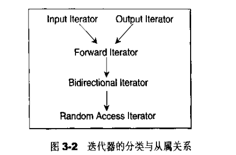

- [迭代器](#迭代器)
  - [主要类别](#主要类别)
  - [Traits编程技术](#traits编程技术)
### 迭代器
- **扮演容器与算法之间的桥梁**，是**所谓的 “泛型指针”**，共有五种类型，以及其它衍生变化。从实现的角度来看，迭代器是一种将 operator*，operator->，operator++，operator-- 等指针相关操作予以重载的 class template。 所有 STL 容器都附带有自己专属的迭代器。 native pointer 也是一种迭代器。


- 是一种smart pointer， 智能指针。迭代器是一种行为类似指针的对象，而指针的**各种行为中最常见的用途是 dereference 和 member access。**迭代器最重要的就是对 operator* 和 operator->进行重载工作。

- auto_ptr：用来包装原生指针(native pointer)的对象，在头文件 中定义。

- 为什么每一种 STL 容器都提供有专属迭代器？
  - 主要是暴露太多细节，所以把迭代器的开发工作交给容器去完成，这样所有实现细节可以得到封装，不被使用者看到
- 迭代器范围： **左闭右开** `begin()` `end()`

#### 主要类别
- **输入迭代器**: read only; 单遍扫描，只能递增
- **输出迭代器**： write only; 单遍扫描， 只能递增
- **前向迭代器**： 可读写；多遍扫描， 只能递增
- **双向迭代器**： 可读写；多边扫描，可增可减
- **随机访问迭代器**： 可读写，多边扫描，支持全部迭代器运算


```c++
// iterator_category 五种迭代器类型
// 标记
struct input_iterator_tag {};
struct output_iterator_tag {};
struct forward_iterator_tag : public input_iterator_tag {};
struct bidirectional_iterator_tag : public forward_iterator_tag {};
struct random_access_iterator_tag : public bidirectional_iterator_tag {};
```
#### Traits编程技术
- traits: 特性， 扮演 “特性萃取机” 角色，萃取各个迭代器的特性(相应类型)。
- 采用的技术原理：
  - **template partial specialization** 模板偏特化/ 部分模板参数特例化
  - 针对 template **参数更进一步的条件限制所设计出来的一个特化版**本，本身仍然是 template。
```c++
// traits 获取各个迭代器的特性(相应类型)-----类型特性类
template <class _Iterator>
struct iterator_traits {
  typedef typename _Iterator::iterator_category iterator_category; // 迭代器类别
  typedef typename _Iterator::value_type        value_type;  // 迭代器解除引用后所得到的值的类型
  typedef typename _Iterator::difference_type   difference_type; // 两个迭代器之间的距离
  typedef typename _Iterator::pointer           pointer;      // 指向被迭代类型的指针
  typedef typename _Iterator::reference         reference;   // 被迭代类型的引用类型
};
```
- 特化实例情况： 
```c++
// 针对原生指针(native pointer)而设计的 traits 偏特化版
template <class _Tp>
struct iterator_traits<_Tp*> {
  typedef random_access_iterator_tag iterator_category;
  typedef _Tp                         value_type;
  typedef ptrdiff_t                   difference_type;  // C++ 内建的 ptrdiff_t 类型
  typedef _Tp*                        pointer;
  typedef _Tp&                        reference;
};

// 针对原生之 pointer-to-const 而设计的 traits 偏特化版
template <class _Tp>
struct iterator_traits<const _Tp*> {
  typedef random_access_iterator_tag iterator_category;
  typedef _Tp                         value_type;
  typedef ptrdiff_t                   difference_type;
  typedef const _Tp*                  pointer;
  typedef const _Tp&                  reference;
};
```
- 迭代器特性：`value_type`: 迭代器所指对象的类型


- `difference type`: 表示两个迭代器之间的距离
```c++
template <class I, class T>
typename iterator_traits<I>::difference_type cout(I first, I last, const T& value)
{
    typename iterator_traits<I>::difference_type n = 0;
    for (; first != last; ++first)
    {
        ++n;
    }
    
    return n;
}
```
- `reference type`: 在 c++ 中，函数如果要传回左值，都是以 by reference 的方式进行，所以如果 p 是一个迭代器，它的 value type 是 T ，那么*p 应该是T& (即reference type)
- `pointer type`
- `iterator category`