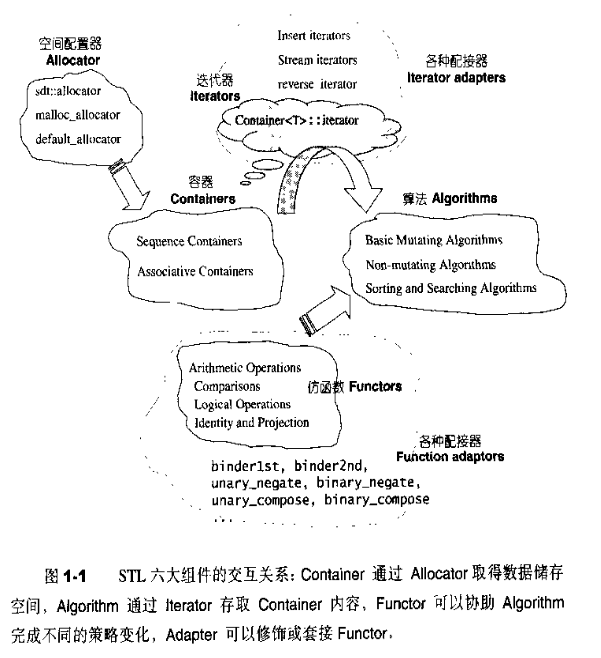

### STL组件

- 容器 containers
  - `vector` `list`等
- 算法  algorithms
  - `sort` `search`等算法实现
- 迭代器 iterators
  - 泛型指针，将Operator*等指针相关操作给予重载的class template
- 仿函数 functors
- 适配器 adapters
  - 用来修饰容器/仿函数/迭代器接口的东西，如queue和stack看似容器，底层完全借助`deque`，所有操作由底层的deque实现。
- 配置器 allocators
  - 进行空间配置和管理，实现了动态空间配置、空间管理和空间释放的class template

-----
参考资料：
https://github.com/steveLauwh/SGI-STL